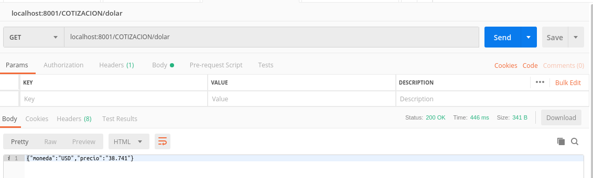

# Web Api RESTful Back End

Web API financiera que permite obtener la cotización en tiempo real de 3 monedas: Dolar, Euro y Real.

## Comenzando

Siga las instrucciones para poder correr el proyecto en su maquina local. 

### Prerrequisitos de Instalación 

```
NPM debe estar instalado. Para instalar NPM [Vea aquí](https://www.npmjs.com/get-npm)
```
```
se debe tener instalado Node. Para instalar Node [Vea aquí](https://howtonode.org/how-to-install-nodejs)
```

### Despliegue en el servidor

Descargue el repositorio y dentro de él abra la Consola y escriba:

```
node server.js
```

Ya puede probar la app desde PostMan en la siguiente dirección:

```
localhost:8001/cotizacion/dolar
```


### Rutas

```
/cotizacion/dolar
```
```
/cotizacion/euro
```
```
/cotizacion/real
```

## Formato de Respuesta

{
“moneda”: “dolar”,
“precio”: “38.2”
}

## Version

1.0.0

## Autor

* **Alejandro Recalde** - *Developer - Rubenrecalde@live.com.ar


## Licencia

Este proyecto esta licenciado bajo la licencia Creative Commons Attribution Share Alike 4.0	cc-by-sa-4.0

